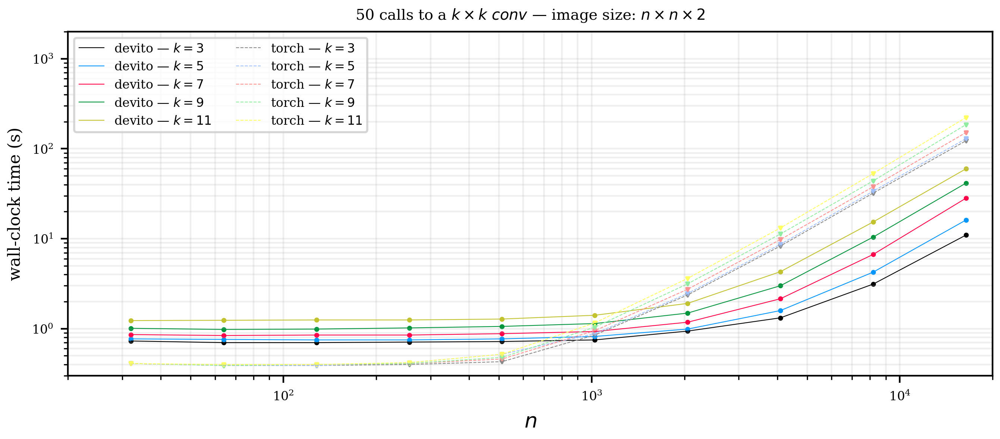
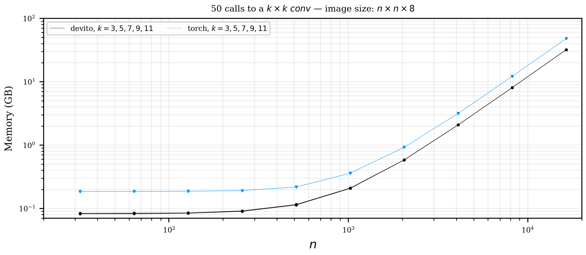

# conv-scaling

[](https://zenodo.org/badge/latestdoi/304717537)

Small experiments comparing the wall-clock time and peak memory consumption of 2D convolution implemented with PyTorch (CPU) and Devito.

Throughout the examples below the image size is `n x n x nch` where `n` is the spacial dimension and `nch` is number of channels. We will run 50 2D convolutions where we vary number of input/output channels, the image size, and convolution kernel size. The wall-clock time and peak memory consumption are computed w/ `/usr/bin/time`.

## Installation

```bash
git clone https://github.com/alisiahkoohi/conv-scaling.git
cd conv-scaling
pip install -e .
```

## Wall-clock time

* number of channels: 2



* number of channels: 4


* number of channels: 8


* number of channels: 16


## Peak memory

* number of channels: 2


* number of channels: 4


* number of channels: 8



* number of channels: 16


